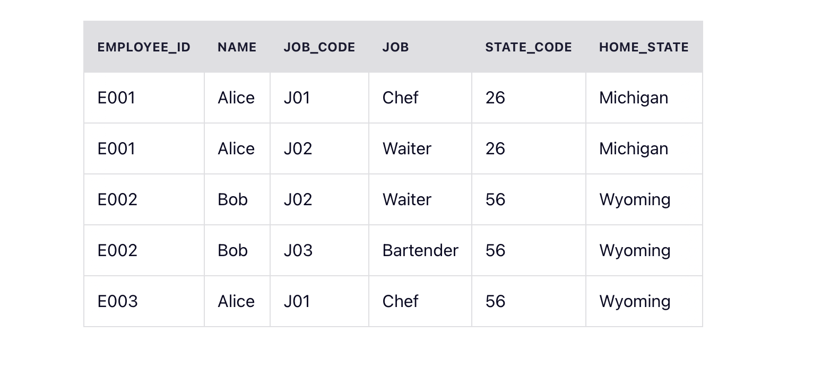
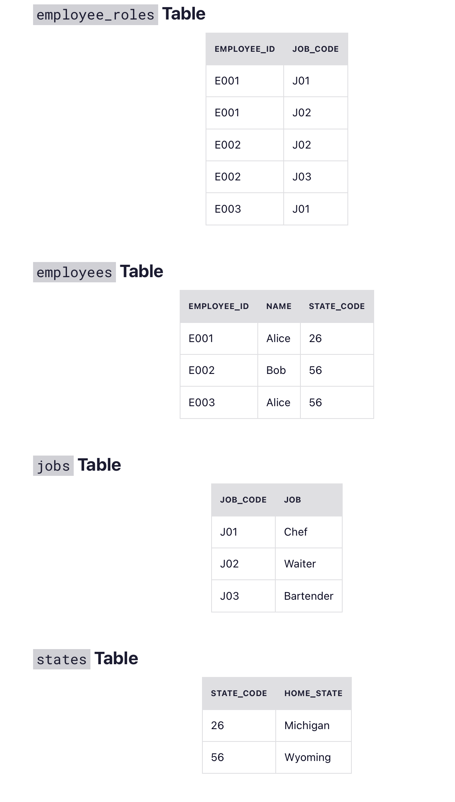

# DB normalization

## The First Normal Form – 1NF
For a table to be in the first normal form, it must meet the following criteria:

*  a single cell must not hold more than one value (atomicity)
*  there must be a primary key for identification
   Note: this is not necessary a single column.. it can be more than one
*  no duplicated rows or columns
*  each column must have only one value for each row in the table
   This means nothing like value1,value2,etc..

## The Second Normal Form – 2NF
The 1NF only eliminates repeating groups, not redundancy. That’s why there is 2NF.

A table is said to be in 2NF if it meets the following criteria:

*  it’s already in 1NF
*  has no partial dependency. That is, all non-key attributes are fully dependent on a primary key.

## The Third Normal Form – 3NF
When a table is in 2NF, it eliminates repeating groups and redundancy, but it does not eliminate transitive partial dependency.

This means a non-prime attribute (an attribute that is not part of the candidate’s key) is dependent on another non-prime attribute. This is what the third normal form (3NF) eliminates.

So, for a table to be in 3NF, it must:

*  be in 2NF
*  have no transitive partial dependency.

## Examples of 1NF, 2NF, and 3NF
Database normalization is quite technical, but we will illustrate each of the normal forms with examples.

Imagine we're building a restaurant management application. That application needs to store data about the company's employees and it starts out by creating the following table of employees:

All the entries are atomic and there is a composite primary key (employee_id, job_code) so the table is in the first normal form (1NF).

But even if you only know someone's employee_id, then you can determine their name, home_state, and state_code (because they should be the same person). This means name, home_state, and state_code are dependent on employee_id (a part of primary composite key). So, the table is not in 2NF. We should separate them to a different table to make it 2NF.

### Example of Second Normal Form (2NF)

**home_state** is now dependent on state_code. So, if you know the state_code, then you can find the home_state value.

To take this a step further, we should separate them again to a different table to make it 3NF.

### Example of Third Normal Form (3NF)

Now our database is in 3NF.

## Conclusion

It is worth noting that most tables don’t exceed the 3NF limit, but you can also take them to 4NF and 5NF, depending on requirements and the size of the data at hand.
